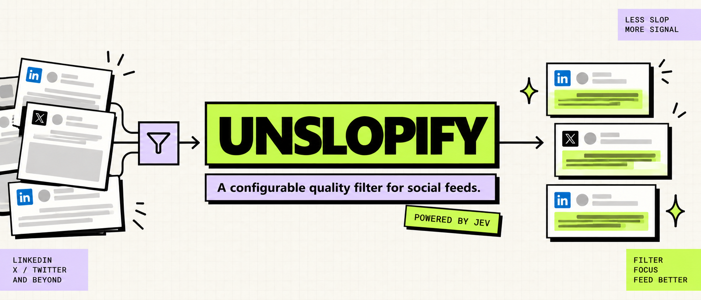

# Unslopify



Unslopify is a Chrome extension for making noisy social feeds a little easier to browse.

It looks for configurable patterns such as AI slop, engagement bait, generic filler, and empty hype. Matching posts can be labeled, blurred, or collapsed. It is a quality filter, not an AI-authorship detector.

## What it does

- Works with LinkedIn and X(maybe) out of the box.
- Lets you enable only the filters you care about.
- Supports label, low-blur, high-blur, and collapsed display modes.
- Offers green, blue, cream, or neutral blur tints.
- Keeps uncertain or failed classifications visible.
- Supports custom feed rules for other sites.
- Lets you add your own filtered and allowed examples for each category.
- Uses either Vercel AI Gateway or TypeSafe directly.

## Install locally

You will need Node.js 22 or newer.

```bash
npm install
npm run build
```

Then:

1. Open `chrome://extensions`.
2. Enable **Developer mode**.
3. Click **Load unpacked** and select the `dist/` directory.
4. Open the extension's **Options** page.
5. Choose an API route, add its key, and enable the sites you want to filter.

## Using it

The options page controls which categories are active, how sensitive each site should be, and what happens to matching posts.

The built-in categories are:

- **AI slop:** polished but interchangeable summaries, checklists, primers, and similar low-value templates.
- **Engagement bait:** content packaged mainly to drive saves, comments, shares, follows, or reactions.
- **Generic filler:** broad platitudes without a useful observation, example, or argument.
- **Empty hype:** promotional claims without concrete details, evidence, or a useful resource.

Advanced settings include request batching, category examples, custom site rules, and settings import/export.

## How Jev fits in

Unslopify uses [Jev by TypeSafe AI](https://docs.typesafe.ai/introduction) to make the classification decisions. Instead of asking a model to write an explanation, the extension sends the post and a set of bounded questions, such as whether it contains engagement bait. Jev returns typed answers with probabilities, and Unslopify applies your chosen thresholds and display settings.

Jev can be accessed through Vercel AI Gateway or TypeSafe directly. Classification is still probabilistic, so uncertain results and request failures remain visible rather than being hidden automatically.

## API keys and privacy

Unslopify uses your own Vercel AI Gateway or TypeSafe API key. Keys stay in restricted extension storage and are never exposed to the pages you visit. By default, a key lasts for the browser session; **Remember API key** stores it locally on that browser without encryption.

Only eligible post text is sent for classification. Comments, messages, drafts, profile pages, search pages, ambiguous cards, and unsupported posts are left alone. Site access is requested only when you enable that site.

Non-secret settings persist across browser restarts.

## Development

```bash
npm test          # offline tests
npm run typecheck # JavaScript and manifest checks
npm run build     # build the extension into dist/
npm run test:e2e  # Chromium smoke test when CHROME_BIN is set
```

Contributions and bug reports are always welcome! Feel free to fork (and star) it and make any changes you want!!
